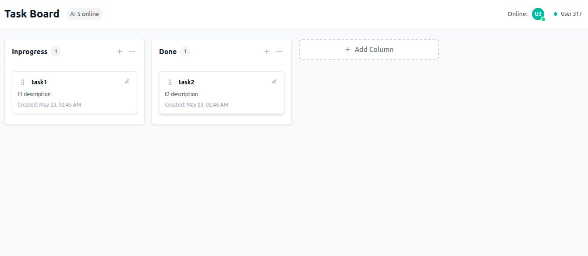

# Collaborative Task Board - Real-time Kanban System



## 🌟 Key Features

### 🎨 Interactive Task Management
- Drag-and-drop task reordering between columns
- Intuitive UI with smooth animations
- Edit tasks with title and description fields
- Visual indicators for task updates

### 👥 Real-time Collaboration
- Live user presence indicators
- Color-coded user avatars
- Instant updates across all connected clients
- See who's online at a glance

### 🏗️ Project Architecture
- **Frontend**: React + Vite + TailwindCSS
- **State Management**: Redux Toolkit
- **Realtime Database**: Firebase
- **Drag-and-Drop**: DnD Kit
- **Deployment**: GitHub Pages

## 🚀 Setup and Run Instructions

### Prerequisites
- Node.js (v18 or higher)
- npm or yarn
- Firebase project with Realtime Database enabled

### Installation
```bash
# Clone the repository
git clone https://github.com/divyanshbarar/collaborative-task-board.git
cd collaborative-task-board

# Install dependencies
npm install


```

### Development
```bash
npm run dev
```

### Production Build
```bash
npm run build
```

### Deployment
```bash
npm run deploy
```

## 🌐 Real-time Architecture

### Data Flow
1. **Client Initialization**:
   - App connects to Firebase
   - Subscribes to board data and presence updates
   - Current user marked as online

2. **User Actions**:
   - Any action (add/move/edit tasks) updates Firebase
   - Firebase broadcasts changes to all connected clients
   - Redux updates local state to match Firebase

3. **Presence System**:
   ```mermaid
   graph TD
     A[User Connects] --> B[Set Online Status]
     B --> C[Update Presence List]
     D[User Disconnects] --> E[Set Offline Status]
     E --> C
   ```

### Bonus Features Implementation

#### Task Reordering
- Uses DnD Kit's sortable context
- Optimistic updates for smooth UX
- Atomic operations via Firebase transactions

#### User Avatars
- Random color assignment on first visit
- Initials-based avatars
- Green dot indicators for online status
- Tooltips with user names

## ⚖️ Tradeoffs and Limitations

### Technical Choices
| Feature | Implementation Choice | Tradeoff |
|---------|----------------------|----------|
| State Management | Redux Toolkit | More boilerplate but predictable |
| Realtime Updates | Firebase subscriptions | Vendor lock-in but easy setup |
| Drag-and-Drop | DnD Kit | Larger bundle size but best UX |

### Current Limitations
1. **Offline Support**: Requires constant connection
2. **Conflict Resolution**: Last write wins strategy
3. **Mobile Experience**: Touch interactions could be improved
4. **Data Limits**: Not optimized for huge boards (1000+ tasks)

## 🔗 Live Deployment

Access the live application at:  
[https://divyanshbarar.github.io/collaborative-task-board/](https://divyanshbarar.github.io/collaborative-task-board/)

## 🛠️ Troubleshooting

If you encounter:
- **Blank page**: Verify Firebase config and base URL
- **Presence issues**: Check Firebase Auth domains
- **Drag problems**: Test in incognito mode (extension conflicts)

## 🚧 Future Improvements
- [ ] Offline support with PouchDB/CouchDB sync
- [ ] Task comments and attachments
- [ ] Board version history
- [ ] Custom user profiles

---

This README provides comprehensive documentation while highlighting the unique aspects of your implementation. The architecture section gives technical stakeholders insight into how the real-time features work, while the tradeoffs section honestly assesses the project's limitations. The live demo link showcases your working implementation.
